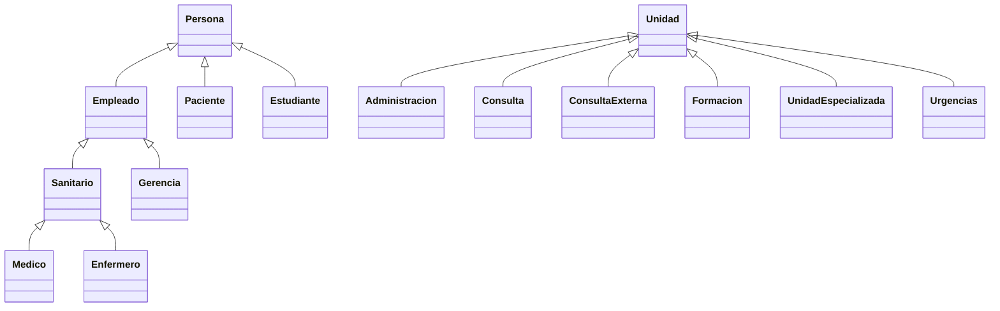

# Gestión de un hospital en Java

Práctica de Programación (UNED) que modela un hospital con programación orientada a objetos: personas, personal sanitario, pacientes, unidades del hospital y citas.

## Funcionalidades

Aplicación de consola con un menú principal:
- Alta de personas
- Gestión de citas
- Altas y bajas de ingresos
- Expedientes
- Búsquedas
- Calendario
- Carga de datos

## Diseño orientado a objetos

El proyecto se organiza en dos jerarquías de herencia.

- **Personas**: `Persona` es la clase base. De ella heredan `Empleado`, `Paciente` y `Estudiante`; de `Empleado`, `Sanitario` y `Gerencia`; y de `Sanitario`, `Medico` y `Enfermero`. La cadena más larga tiene cuatro niveles (`Persona` → `Empleado` → `Sanitario` → `Medico`).
- **Unidades**: `Unidad` es la clase base de las distintas áreas del hospital: `Urgencias`, `Consulta`, `ConsultaExterna`, `UnidadEspecializada`, `Administracion` y `Formacion`.
- **Resto de clases**: `Hospital` (punto de entrada), `Agenda`, `Cita`, `Datos` y `Metodos`.

## Cómo ejecutarlo
    javac -d out src/*.java
    java -cp out Hospital

## Tecnologías
Java · POO · herencia
